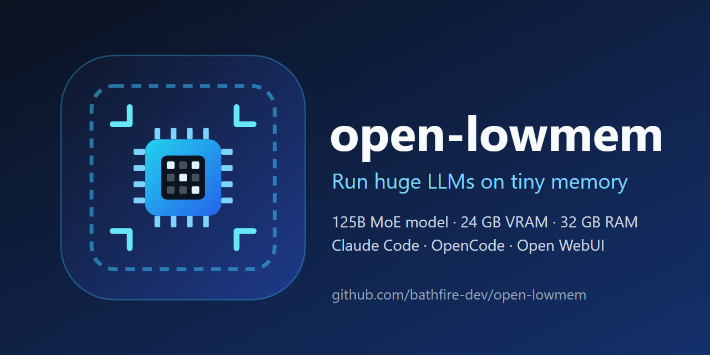

# open-lowmem: rode um LLM de 125B em uma GPU de 24 GB e 32 GB de RAM (Windows)

[English](README.md) | [简体中文](README.zh-CN.md) | [繁體中文](README.zh-TW.md) | [日本語](README.ja.md) | [한국어](README.ko.md) | [Español](README.es.md) | [Français](README.fr.md) | [Deutsch](README.de.md) | [Русский](README.ru.md) | [Português](README.pt-BR.md)

**Rode LLMs enormes com pouca memória.** Inicializadores para Windows com um clique que executam localmente um **modelo MoE de 125 bilhões de parâmetros (Qwen3.8-Flash-Next)** em um PC comum com **placa de vídeo de 24 GB e 32 GB de RAM**, e o conectam ao **Claude Code, OpenCode, ao app de desktop do Claude e ao Open WebUI**. Offline, privado e gratuito.

Autor: **廖亦辰 (Liao Yichen)** · Xiamen, China · GitHub [@bathfire-dev](https://github.com/bathfire-dev) · Licença: MIT

> Se isto poupou um fim de semana de configuração, uma estrela ajuda outras pessoas com GPUs pequenas a encontrar o projeto.

## O que é isto?

`open-lowmem` é um conjunto de pequenos inicializadores em Go para Windows. Cada um inicia primeiro o motor de inferência local [Strata](https://github.com/Niko1221/Strata), que faz um modelo de mistura de especialistas de 125B parâmetros caber em um PC gamer comum, dividindo o trabalho entre a VRAM da GPU, a RAM do sistema e o SSD. Depois o inicializador abre o cliente escolhido e limpa tudo quando você fecha a janela.

Palavras-chave: LLM local, pouca VRAM, pouca memória, rodar modelos de linguagem grandes em GPU de 24 GB, MoE, quantização (IQ2_XS), Qwen3.8-Flash-Next, Strata, Claude Code com modelo local, OpenCode, assistente de programação com IA offline, RTX 4090, Windows.

## Quanta memória é necessária?

Os números vêm da [documentação do Strata](https://github.com/Niko1221/Strata), e não de medições deste repositório:

| Tamanho (mesmo modelo) | RAM + VRAM necessárias | Observações |
| --- | --- | --- |
| Q2_0 | cerca de 37,6 GB | mais rápido |
| IQ2_XS | cerca de 39,2 GB | recomendado; configuração padrão deste repositório |
| IQ3_XXS / IQ3_S | cerca de 47 / 55 GB | melhor qualidade, exige mais RAM |

O Strata exige uma placa NVIDIA ou AMD de 12 GB ou mais, 32 GB ou mais de RAM e cerca de 80 GB de disco livre. Os autores mediram 79 tokens/s em uma RTX 5070 (12 GB) com 64 GB de RAM para o IQ2_XS. Com uma placa de 24 GB e 32 GB de RAM, Q2_0 e IQ2_XS rodam no modo de pouca RAM do Strata. Este repositório é desenvolvido em uma RTX 4090D de 24 GB com 32 GB de RAM.

## Inicializadores

| Inicializador | O que faz |
| --- | --- |
| `claude-strata.exe` | Inicia o Strata e executa o seu Claude Code instalado com `--settings`. Seu `~/.claude` não é alterado. |
| `claude-strata-ui.exe` | Seletor de pasta e, em seguida, o Strata e a interface web `claude-code-webui`. |
| `claude-desktop-strata.exe` | Inicia o Strata, grava um perfil de gateway de terceiros para o app de desktop do Claude e abre o app. |
| `opencode-qwen.exe`, `opencode-qwen-web.exe` | OpenCode no terminal e na web, com a configuração embutida. |
| `opencode-qwen-strata-desktop.exe` | Inicia o Strata e depois o app de desktop do OpenCode. |
| `openwebui-qwen.exe` | Ollama mais Open WebUI. |

Fechar a janela do inicializador encerra todos os processos filhos por meio de um Job Object do Windows, então nenhum modelo continua ocupando a sua VRAM.

## Perguntas frequentes

**Posso rodar um modelo de 125B parâmetros em uma GPU de 24 GB?**
Sim, com um modelo de mistura de especialistas e um motor que divide os especialistas entre VRAM, RAM e SSD. É isso que o Strata faz; este repositório apenas o conecta às suas ferramentas. Conte com cerca de 39 GB de RAM e VRAM somadas para o IQ2_XS.

**Como uso o Claude Code com um modelo local?**
O Strata expõe um endpoint compatível com a Anthropic (`/v1/messages` em `127.0.0.1:8090`). O `claude-strata.exe` inicia o Strata e abre o Claude Code com uma camada de configuração que aponta para ele, usando como alias um nome de modelo do Claude, como `claude-sonnet-4-6`. O Claude Code em si não está incluído; instale-o pela Anthropic.

**O app de desktop do Claude funciona?**
Não verificado. O perfil é gravado, mas não se sabe se o app aceita um gateway `http://127.0.0.1:8090` sem HTTPS. Trate o `claude-desktop-strata.exe` como experimental.

**A qualidade é igual à dos modelos na nuvem?**
Não. A quantização em poucos bits troca qualidade por memória. Nos rankings públicos, o Qwen3.8-Flash-Next é um bom modelo aberto, mas não um modelo fechado de ponta, e parte dessas pontuações é informada pelo próprio fornecedor.

**Funciona no Linux ou no macOS?**
Por enquanto não. Os inicializadores usam APIs do Windows.

## Avisos importantes

- Strata, OpenCode, Claude Code, o app de desktop do Claude e os pesos do modelo **não estão incluídos**. Instale-os por conta própria.
- Projeto pessoal independente, sem ligação com a Anthropic, a Alibaba Cloud (Qwen), o Strata ou o OpenCode.

## Compilar a partir do código-fonte

1. Instale Go 1.25+, Node.js e PowerShell 5.1+.
2. Coloque o Strata em `strata\Strata-main` (ou defina `STRATA_DIR`) e gere o `run-*.bat` dele.
3. Rode `npm install` em `opencode\` (inicializadores do OpenCode) e em `claudeui\` (interface web).
4. Rode `.\build.ps1`, ou `.\build.ps1 -Only <nome>` com um de: tui, web, desktop, openwebui, strata, claude, claudewrap, claudeui, claudedesktop. A saída vai para `dist\`.

## Como contribuir

Issues e pull requests são bem-vindos, principalmente: resultados de teste do caminho do app de desktop do Claude, números de velocidade em outras GPUs e um port para Linux. Informe sua GPU, sua RAM e o tamanho do modelo do Strata. As traduções também podem ser melhoradas.

## Grupo de bate-papo (opcional)

Grupo de WeChat "AI时代", principalmente em chinês (o QR code expira em 14 de outubro; abra uma issue se tiver expirado):

## Créditos e licenças de terceiros

[Strata](https://github.com/Niko1221/Strata), [OpenCode](https://github.com/anomalyco/opencode) (MIT), [claude-code-webui](https://github.com/sugyan/claude-code-webui) (MIT) e o modelo Qwen mantêm cada um a sua própria licença.
